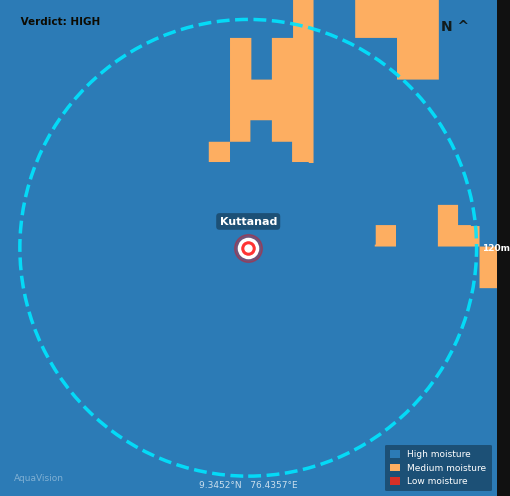

# 🌊 AquaVision — Explainable Geo-AI Borewell Advisory System

AquaVision is an Explainable Geo-AI system designed to estimate groundwater potential before borewell drilling using satellite intelligence, hybrid AI, and explainable reasoning.

The system combines:
- 🌍 Google Earth Engine satellite analysis
- 🧠 Hydrogeological rule-based scoring
- 🤖 RandomForest machine learning refinement
- ✨ LLM-powered groundwater reasoning
- 🗺️ Groundwater visualization maps

AquaVision aims to reduce failed borewell drilling by providing scientifically grounded but farmer-friendly groundwater advisory reports.

---

# 🚨 Problem Statement

Farmers in many regions drill borewells without scientific groundwater guidance, often leading to:
- Failed drilling attempts
- Financial loss
- Water scarcity
- Agricultural uncertainty

Traditional groundwater surveys are:
- Expensive
- Time-consuming
- Difficult to access at farm level

AquaVision addresses this problem using satellite-derived groundwater indicators and explainable AI-driven recommendations.

---

# ✅ Key Features

- 🌍 Google Earth Engine integration
- 🌱 NDVI vegetation analysis
- 💧 NDWI surface water analysis
- 🌊 NDMI soil moisture analysis
- ⛰️ Elevation & slope analysis
- 🧠 Hybrid Rules + RandomForest architecture
- ✨ Gemini-powered explainability layer
- 🗺️ Precision groundwater moisture maps
- 📋 Farmer-friendly groundwater advisory
- ⚠️ Risk-aware drilling recommendations
- 🔄 Fallback system for API failures

---

# 🏗️ System Architecture

```text
Farmer Coordinates
        ↓
Google Earth Engine
        ↓
Satellite Feature Extraction
(NDVI, NDWI, NDMI, Elevation, Slope)
        ↓
Hydrogeological Rule Engine
        ↓
RandomForest ML Refinement
        ↓
Gemini Explanation Layer
        ↓
Groundwater Map Generation
        ↓
Final Borewell Advisory
```

# 🖥️ Sample Output

```text
==================================================
🌊 AQUAVISION ANALYSIS COMPLETE
==================================================
📍 Location: Kuttanad (9.3452°N, 76.4357°E)
📏 Buffer: 120m radius
🛰️ Readings: NDMI: 0.229  NDWI: -0.471  NDVI: 0.499  Elev: 0m  Slope: 2.1°

🔵 Verdict: HIGH
📈 Confidence: 79.9%
🤖 RF Model: Yes
✨ AI Layer: Gemini

📋 Summary:
Groundwater potential at this location is high.

🛰️ Satellite Interpretation:
• High soil moisture indicates strong subsurface moisture retention.
• Dense vegetation suggests reliable moisture availability.
• Flat terrain supports groundwater infiltration and recharge.

💡 Advice:
Consider moderate-depth borewell exploration after local verification.

⚠️ Risk:
Groundwater yield may still vary seasonally despite favorable recharge conditions.
```

---

MAP:



---

# ⚙️ Tech Stack

## Backend
- Python

## Geospatial Intelligence
- Google Earth Engine
- Sentinel-2 Imagery
- SRTM DEM

## Machine Learning
- RandomForest
- scikit-learn

## Explainable AI
- Gemini API

## Visualization
- matplotlib
- Pillow

## Data Processing
- pandas
- NumPy

---

# 📂 Project Structure

```text
AquaVision/
│
├── app.py
├── ai_advisor.py
├── classifier.py
├── gee_engine.py
├── map_generator.py
├── rules.py
├── train_model.py
├── aqua_model.pkl
├── requirements.txt
├── README.md
│
└── static/
```

---

# 🚀 Installation & Setup

## 1. Clone Repository

```bash
git clone https://github.com/YOUR_USERNAME/AquaVision.git

cd AquaVision
```

## 2. Create Virtual Environment

```bash
python -m venv venv
```

### Activate Environment (Windows)

```bash
venv\Scripts\activate
```

## 3. Install Dependencies

```bash
pip install -r requirements.txt
```

## 4. Configure Environment Variables

Create a `.env` file:

```env
GEMINI_API_KEY=YOUR_API_KEY
GEE_PROJECT=YOUR_GEE_PROJECT
```

## 5. Authenticate Google Earth Engine

```bash
earthengine authenticate
```

## 6. Train Model

```bash
python train_model.py
```

## 7. Run AquaVision

```bash
python app.py
```

---

# 🔮 Future Scope

- 📱 WhatsApp integration
- ☁️ Cloud deployment
- 🌧️ Rainfall integration
- 🌍 Regional calibration
- 🗣️ Multilingual support
- 🪨 Aquifer mapping
- 📈 Seasonal groundwater forecasting

---

# 🎯 Vision

AquaVision aims to make groundwater intelligence:
- accessible
- explainable
- scalable
- farmer-friendly

through the combination of satellite intelligence and explainable AI.

---
# 👨‍💻 Team

Developed as part of a hackathon prototype focused on sustainable groundwater advisory and Explainable Geo-AI systems.